# Via Optimization Wizard

English | [繁體中文](README.zh-TW.md)

Provided by Jeff Hong, Senior Technical Engineer, Taiwan Auto-Design Co. (TADC).

---

## The problem this solves

Ansys optiSLang is a powerful multi-objective optimizer, but first-time users
often get lost in parameter registration, workflow wiring, and result
navigation before they ever see its value. This project wraps a real
signal-integrity problem — **PCB differential via geometry optimization** —
into a four-step wizard:

1. **Example & stackup**: a built-in 12-layer differential via with backdrill,
   or import the stackup from your own board
2. **Design space**: four geometric variables (antipad, pitch, GND via
   distance, backdrill stub) set by range sliders, with a live via-layout
   preview and zero-solve analytical metrics
3. **Objectives & constraints**: reflection (TDR |Γ| peak) vs. routing
   keep-out area as competing objectives; stub resonance frequency as a
   constraint — a stub long enough to drop its notch into the operating band
   is eliminated outright
4. **Run**: the classic optiSLang three-stage flow executes in the background,
   progress streams to the browser, and one click opens the native optiSLang
   post-processing when done

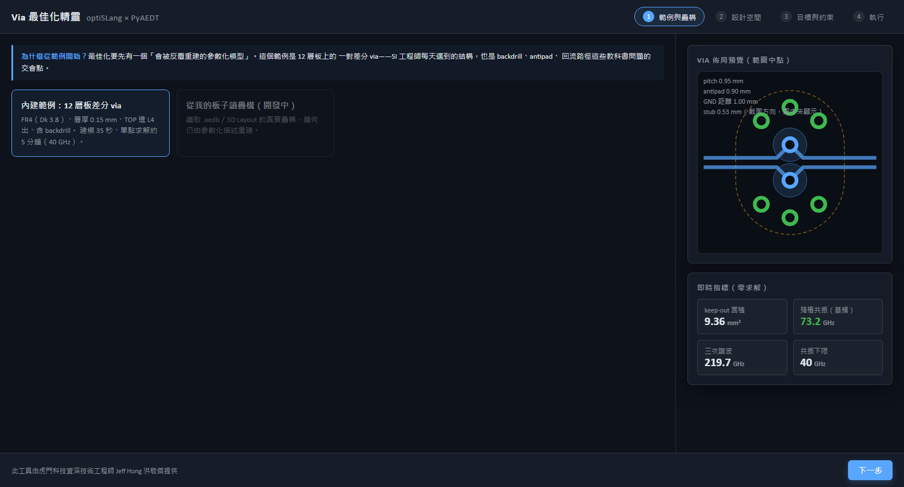

## Both ends of the design space come from physics, not guesswork

The stub-length range is derived, not chosen:

```
stub_mm   0.15  ~  0.8933
            ↑         ↑
   backdrill tolerance   40 GHz resonance floor
```

**The upper bound is computed.** Resonance = c / (4 · stub · √Dk) is strictly
decreasing in stub, so "resonance ≥ 40 GHz" and "stub ≤ 0.8933 mm" are
*exactly* equivalent. Encoding a constraint as a bound beats letting the
optimizer wander into the infeasible region and then penalising it — the
penalty makes the surrogate learn an artificial cliff (measured: CoP drops
from 97.9% to 89.4%) and burns 11% of the sampling budget on points that
carry no information.

**The lower bound is manufacturability.** A 0.05 mm stub is 50 µm, below
typical backdrill tolerance (±50–100 µm) — an optimizer should not recommend
a design that cannot be built. Adjust this to your supplier's actual
capability; it is a process limit, not a physical constant.

A bonus: 0.05 mm also sits in an HFSS instability pocket. For one fixed
geometry, a 0.05 mm stub stalled 3 of 4 solves in the frequency-sweep stage
(88 / 33 / 15 minutes with no CPU activity); the same geometry at 0.15 mm
solved once, in 12.7 minutes. **The corner an optimizer loves is exactly
where the solver is least reliable** — without stall detection, an automated
flow will sit silently stuck on the one point that matters most.

## Why vias, why TDR

Vias are the structure SI engineers face every day — antipads, return paths,
and backdrill stubs all intersect here. And the TDR impedance profile is the
most actionable way to look at them: a dip means capacitive (antipad too
small, pad too large), a bump means inductive (GND vias too far, pitch too
wide). Engineers see the direction to turn at a glance.

The two objectives genuinely fight each other: opening the antipad and
pulling GND vias away improves the electrical response but costs routing
area. That is exactly why the Pareto front matters — optiSLang lays out the
whole trade-off curve instead of handing you a single "optimum."

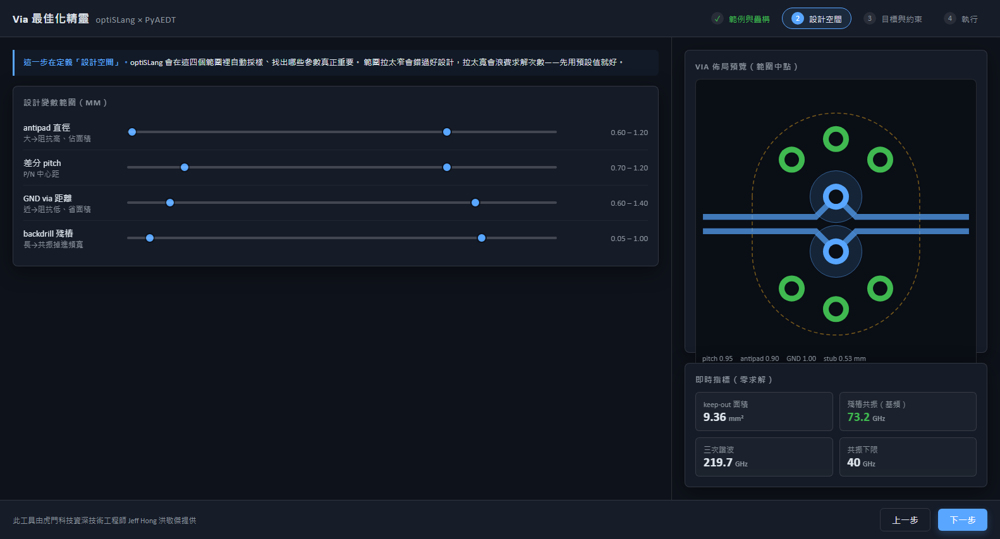
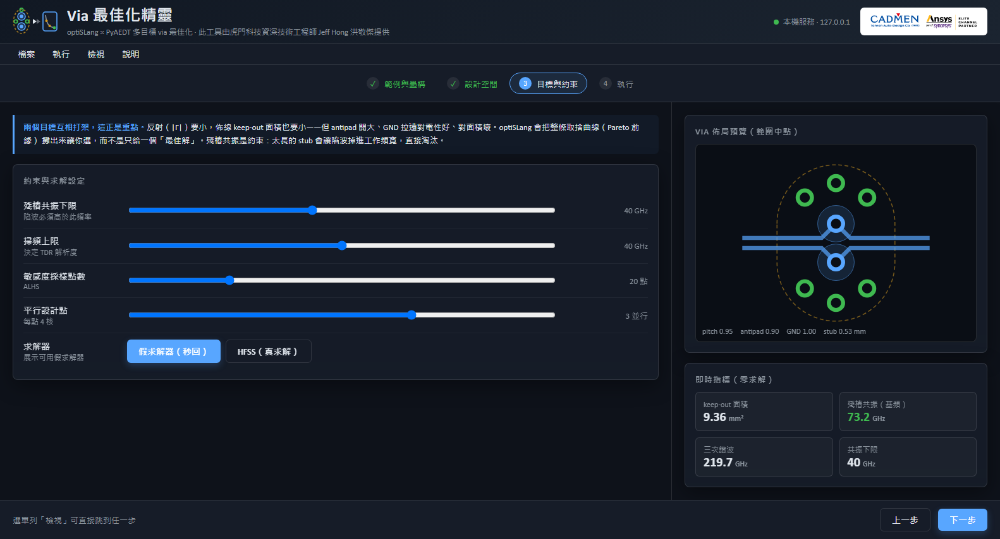

## Architecture

```
design vars ──> model description (JSON) ──> PyEDB modeler ──> HFSS 3D Layout
                                                                    │
optiSLang three-stage flow                                     Touchstone
  Sensitivity (ALHS, real solves, parallel dispatch)                │
  ↓                                                          scikit-rf IFFT
  MOP surrogate                                                     │
  ↓                                                       TDR impedance profile
  Multi-objective EA (on the MOP, seconds)  <── |Γ| peak extraction ┘
```

- **Every design point rebuilds the model** from a parametric JSON
  description rather than AEDT variables — which makes the solver a swappable
  interface (HFSS / pre-run lookup / SimAI in the future)
- **Real solves happen only in the sensitivity stage**: the EA's hundreds of
  evaluations all hit the MOP surrogate, so optimization and weight changes
  can re-run without HFSS present
- **The three responses deliberately span three orders of cost**: keep-out
  area (closed-form), stub resonance (quarter-wave formula), reflection peak
  (HFSS solve) — constraint-violating designs are skipped before any solve

## Measured numbers (14-core laptop, 4 cores/point, 2 parallel)

| Item | Value |
| --- | --- |
| Modeling (JSON → .aedb, 12-layer board) | 35 s |
| Single HFSS solve (40 GHz sweep) | 4–5 min once warm |
| **First design point** (incl. AEDT cold start) | **30+ min** |
| 120-point sensitivity study (2 parallel) | 7.1 h (4.1 min per real solve) |
| EA optimization, 90–240 evaluations (on MOP) | seconds |
| Loading a pre-run backup study | 0.45 s |
| Surrogate refit + NSGA-II (pure Python) | ~25 s |

**That 30-minute first point is the demo landmine**: AEDT cold start and
.NET assembly loading are all charged to the first design point. If you plan
to solve live, warm the machine up with one throwaway solve first.

Do not exceed 2 parallel: at 3, HFSS's MPI manager `hydra_pmi_proxy.exe`
crashes repeatedly (0xC0000005, observed 4 times).

The 40 GHz sweep ceiling was determined by a monotonicity experiment: with
four designs of known quality ordering, 20 GHz scrambles the |Γ| ranking
entirely (the TDR resolution exceeds the via length), while 40 GHz and
60 GHz agree exactly. Optimization needs correct ranking — 40 GHz suffices.

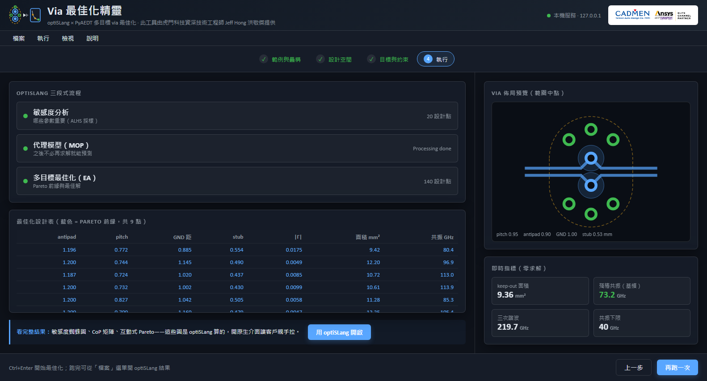

## Native optiSLang post-processing (24-point HFSS study)

One click opens the optiSLang post-processor when the run completes — every
chart below is computed and rendered by optiSLang itself, from a 24-point
40 GHz HFSS sensitivity study (20 succeeded, 4 failed; the failures are
honestly kept in the statistics).

**MOP response surface**: the Kriging surface of stub length vs. resonance
frequency, CoP = 98% — the quarter-wave physics fully captured by the
surrogate, with residuals hugging the diagonal:

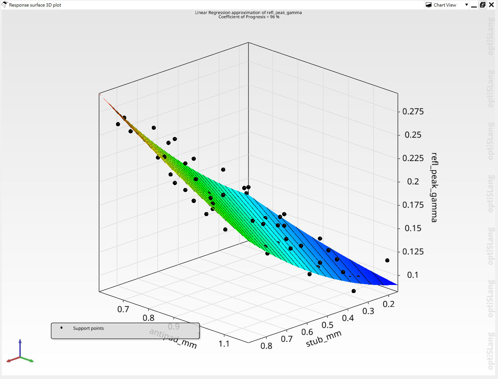

**Sensitivity analysis**: correlation matrix and coefficients. The CoP
matrix shows each parameter's contribution to each response (GND distance
85.7% for keep-out area, stub 98% for resonance) — which knobs matter, at
a glance:

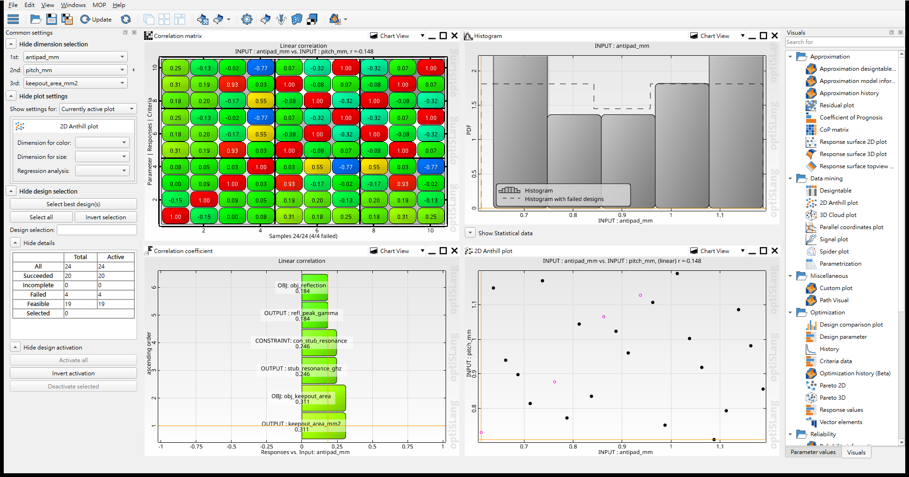

**Pareto front**: the reflection vs. routing-area trade-off with the front
in red, alongside the selected best design's parameters, responses, and
constraint margin:

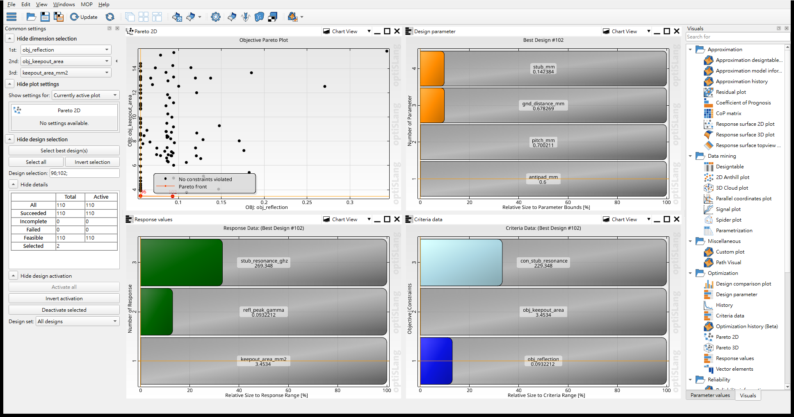

## Public scope vs. private implementation

This repository is a **case-study showcase**: the frontend source
(React + Vite + TypeScript), documentation, and workflow diagrams are public.
The backend implementation (PyEDB modeler, HFSS orchestration, TDR
computation, PyOptiSLang flow builder) is private and not included, so a
clone is not runnable as-is.

For technical engagements and simulation services, contact TADC:
jeff.hong@cadmen.com

## Requirements (private backend)

- Windows 10/11 (64-bit)
- Ansys Electronics Desktop 2025 R2 (HFSS) + optiSLang 2025 R2 or later,
  properly licensed
- Python 3.10; pyaedt 0.23.0, pyedb 0.65.1, ansys-optislang-core 1.5.0,
  scikit-rf 1.8.0, FastAPI

## Project mode: run the customer's own board

Step 1 can switch to "read the stackup from my board": point it at an `.aedb`
(paste the path or use the browse dialog) and the tool reads the real stackup
read-only — layer names, thicknesses, Dk/Df — then you pick the exit layer.
The geometry is still rebuilt from the parametric description (see ADR-0001);
the customer board contributes only its stackup.

Below is a **real 12-layer board** (23 stackup entries including dielectrics,
2.429 mm thick, weighted Dk 4.4, TOP in / inner L5 out) run as a 16-point
40 GHz study — **16/16 solved successfully**, 93.7 minutes at 2 parallel:

**Reflection MOP surface** (Moving Least Squares, CoP 83%): plotted against
stub length and antipad, the corner with a small antipad and a long stub
rises into a "reflection hill", with a flat low-reflection plain on the other
side — which way to turn is obvious at a glance. The CoP matrix on the right
lays out every parameter's contribution to every response: stub 98.9% for
resonance, stub 81.2% for reflection, GND distance 85.1% for area — which
single knob dominates each response is written cell by cell:

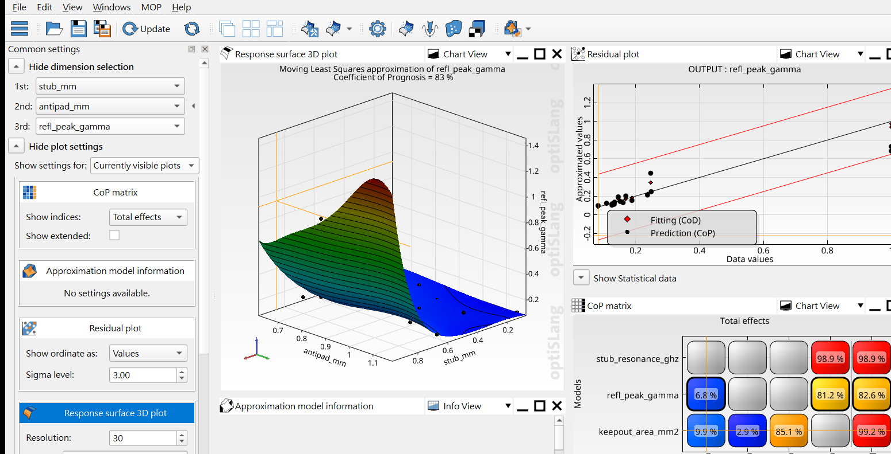

**Area MOP surface** (CoP 99%) — a purely geometric quantity predicts almost
perfectly, residuals hugging the diagonal:

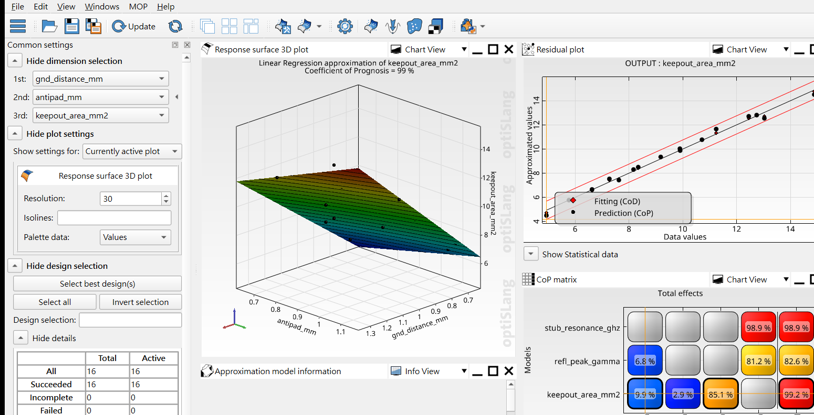

**Pareto front**: the optimizer ran 150 evaluations on the MOP, all feasible,
6 landing on the front. At 4.87 mm² the reflection is 0.102; spending up to
5.63 mm² buys 0.077 (25% better); going on to 7.64 mm² buys almost nothing —
**the marginal return on area runs out around 5.6 mm²**:

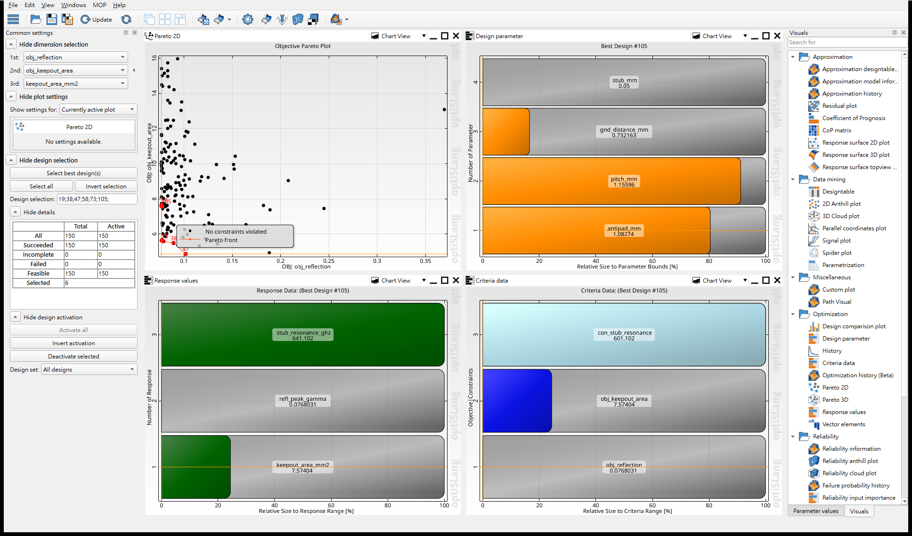

## "Can we trust the TDR you compute yourselves?"

That is the first question every customer asks, so the answer is a
cross-check against Ansys's own engine: the same Touchstone goes through
this tool's scikit-rf IFFT on one path and through **AEDT Circuit's Nexxim
time-domain convolution** (the official TDR probe) on the other. The design
compared is the worst-reflecting point of the 16-point study.

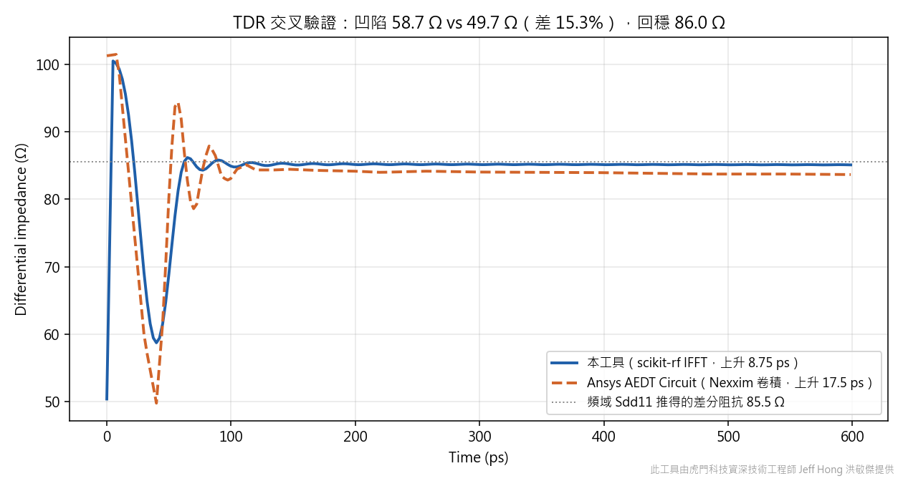

| Metric | This tool | AEDT Circuit | Frequency-domain Sdd11 | Difference |
| --- | ---: | ---: | ---: | ---: |
| Settled differential impedance | 85.2 Ω | 86.0 Ω | **85.5 Ω** | **all three agree** |
| Dip position | 40 ps | 40 ps | — | coincident |
| Impedance dip depth | 58.7 Ω | 49.7 Ω | — | 15.3% |

**Three independent paths agree on the settled level**: this tool's IFFT,
AEDT's Nexxim time-domain convolution, and the value obtained algebraically
from the frequency-domain Sdd11. They share no code, so agreement is not the
same error computed three times. In the chart, both curves' tails sit on the
same dotted line.

### These numbers changed, and the reason is worth telling

This section previously read "dip agrees to 1.4%, settled level off by
12.7 Ω, unresolved". Investigation showed **that flattering 1.4% was two
errors cancelling**.

HFSS's exported Touchstone fills the very low frequencies (below roughly
1 MHz) with extrapolated values rather than solved ones — across five
designs the differential impedance there reads 63.7 / 75.0 / 84.1 / 88.6 Ω,
differently wrong in every file, where the true value is 84–86 Ω. A step
response's final value *is* ρ(DC), so that fabricated data dragged the whole
TDR baseline down: measured across 107 designs, systematically low by
**19.5 ± 7.1 Ω**. With the baseline pulled down, the dip's absolute value
came down with it — and happened to land on AEDT's dip.

The fix discards data below 10 MHz and extrapolates from the flat region
instead (a differential via is electrically tiny; its impedance is flat from
DC to several GHz, so that band carries no physics). After the fix:

- Settled-vs-frequency-domain gap: 19.5 ± 7.1 Ω → **0.5 ± 0.1 Ω** (107
  designs, full range 0.1–0.8)
- |Γ| shifts by −2.9% at the median; ranking Spearman **0.9982** (largest
  move 8 places)
- But dip-depth agreement went from 1.4% to 15.3% — **the baseline is right
  now, the dip is not yet**

That remaining 15.3% is listed here rather than cropped out. This tool's
curve is visibly smoother (it applies resolution-based smoothing; AEDT does
not), which explains the direction but not the magnitude. It must be settled
before quoting *absolute* dip depth; the ranking that drives the optimization
is unaffected (Spearman 0.9982).

## We verify our own recommendation

The |Γ| values along a Pareto front are **predictions, not solves**. So the
front's lowest-|Γ| design gets solved for real in HFSS (4 minutes):

| | |
| --- | --- |
| Surrogate prediction | 0.0487 |
| **HFSS actual** | **0.0790** |

**Off by 38%** — from a surrogate whose CoP is 0.9799, which looks excellent.

The reason: an optimizer **always pushes designs into the corners** of the
design space (three of that design's four variables sit on a bound), and the
corners are extrapolation territory. CoP is measured on interior samples and
never tests extrapolation. On the same data a Gaussian process predicts
0.0751 there (−5% error) while an RBF predicts 0.0487 (−38%) — and their CoP
differs by only 0.0015, noise-level, yet that is what selected the model. A
GP reverts to the mean away from data; an RBF extrapolates without bound and
can invent an optimum better than anything ever observed.

The fix: treat CoP differences under 0.01 as a tie and break ties by
extrapolation safety. Error drops from −38.4% to −14.9%, with CoP going only
from 0.9799 to 0.9792.

**This applies to any surrogate-based optimization, optiSLang's MOP
included.** Hence the built-in step of actually solving the recommended
optimum — four minutes for a number you can defend to a customer.

## Acknowledgment

The parametric via modeling in this project is based on **Via Wizard** by
**Ming-Chih Lin** ([linmingchih](https://github.com/linmingchih)), a former
Ansys technical expert. The stackup, padstack, backdrill, and differential
fan-out modeling core was adapted from his work — special thanks to him.

## Notice

This is Jeff Hong's personal technical portfolio. It is not an official
account of Taiwan Auto-Design Co. (TADC). Ansys is a trademark of Ansys,
Inc.; this portfolio is not officially affiliated with Ansys, Inc.

All screenshots were captured from a single real session using the built-in
demo data; no customer information is included.
